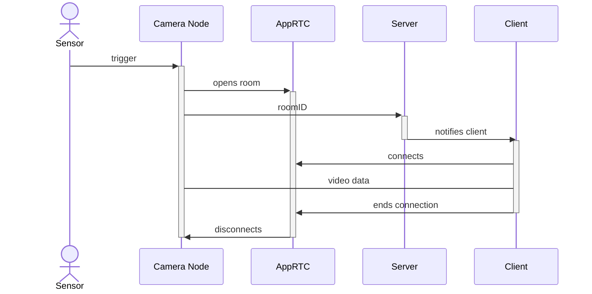

# IoTRTC
RTC streaming from IoT devices

## Architecture

The framework consists of different virtualized services that allow video streaming from devices without a graphical user interface. 
The interaction between all services is depicted in the following sequence diagram:

## Publication
The RTC streaming framework from IoT devices is developed by [Computer Networks Group](https://www.uni-bamberg.de/ktr/). 

It was used in the following publication:
- <a href="https://link.springer.com/chapter/10.1007/978-3-031-40852-6_16" target="_blank"> **Efficient Internet of Things Surveillance Systems in Edge Computing Environments: Accessible via Web Based Video Transmissions from Low-Cost Hardware**</a> (at I4CS 2023)
